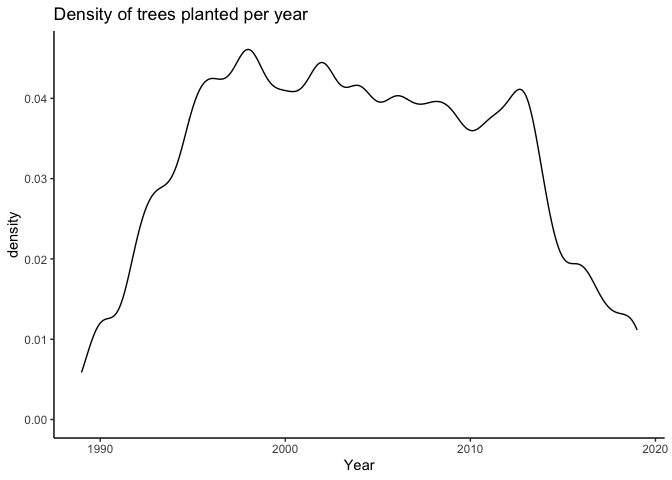
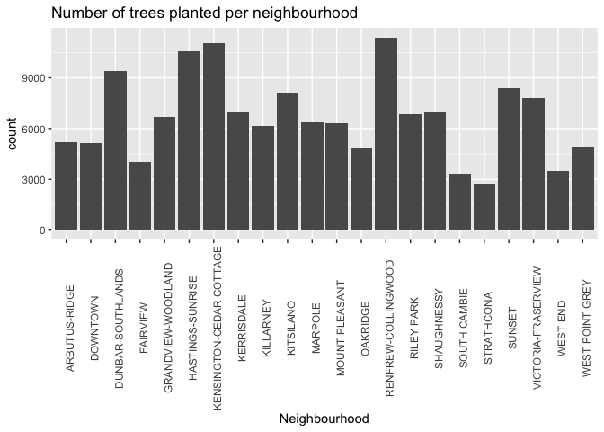
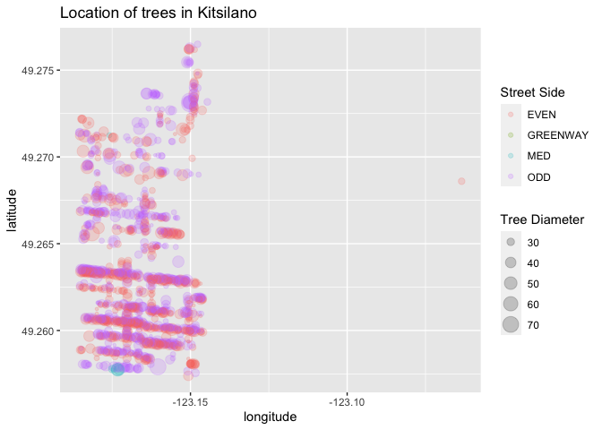
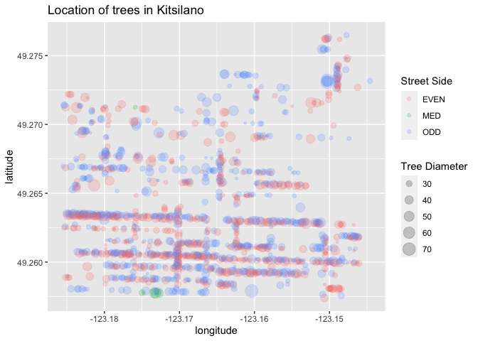

Milestone1
================
pattiey

# Pattie Ye’s Mini Data Analysis: Milestone 1

# Choosing a dataset from the `datateachr` package

First load the libraries

``` r
suppressMessages(library(datateachr))
suppressMessages(library(tidyverse))
# I need the lubridate package to efficiently extract the date
suppressMessages(library(lubridate))
# I need the ggridges package
suppressMessages(library(ggridges))
```

From the 7 datasets in `datateachr` my top 4 choices are:

1.  `cancer_sample`: characteristics of cell nuclei from digitized
    images of breast mass

``` r
# Look at column names
names(cancer_sample)
```

    ##  [1] "ID"                      "diagnosis"              
    ##  [3] "radius_mean"             "texture_mean"           
    ##  [5] "perimeter_mean"          "area_mean"              
    ##  [7] "smoothness_mean"         "compactness_mean"       
    ##  [9] "concavity_mean"          "concave_points_mean"    
    ## [11] "symmetry_mean"           "fractal_dimension_mean" 
    ## [13] "radius_se"               "texture_se"             
    ## [15] "perimeter_se"            "area_se"                
    ## [17] "smoothness_se"           "compactness_se"         
    ## [19] "concavity_se"            "concave_points_se"      
    ## [21] "symmetry_se"             "fractal_dimension_se"   
    ## [23] "radius_worst"            "texture_worst"          
    ## [25] "perimeter_worst"         "area_worst"             
    ## [27] "smoothness_worst"        "compactness_worst"      
    ## [29] "concavity_worst"         "concave_points_worst"   
    ## [31] "symmetry_worst"          "fractal_dimension_worst"

``` r
# Dimensions
dim(cancer_sample)
```

    ## [1] 569  32

``` r
# Data class of each column
sapply(cancer_sample, class)
```

    ##                      ID               diagnosis             radius_mean 
    ##               "numeric"             "character"               "numeric" 
    ##            texture_mean          perimeter_mean               area_mean 
    ##               "numeric"               "numeric"               "numeric" 
    ##         smoothness_mean        compactness_mean          concavity_mean 
    ##               "numeric"               "numeric"               "numeric" 
    ##     concave_points_mean           symmetry_mean  fractal_dimension_mean 
    ##               "numeric"               "numeric"               "numeric" 
    ##               radius_se              texture_se            perimeter_se 
    ##               "numeric"               "numeric"               "numeric" 
    ##                 area_se           smoothness_se          compactness_se 
    ##               "numeric"               "numeric"               "numeric" 
    ##            concavity_se       concave_points_se             symmetry_se 
    ##               "numeric"               "numeric"               "numeric" 
    ##    fractal_dimension_se            radius_worst           texture_worst 
    ##               "numeric"               "numeric"               "numeric" 
    ##         perimeter_worst              area_worst        smoothness_worst 
    ##               "numeric"               "numeric"               "numeric" 
    ##       compactness_worst         concavity_worst    concave_points_worst 
    ##               "numeric"               "numeric"               "numeric" 
    ##          symmetry_worst fractal_dimension_worst 
    ##               "numeric"               "numeric"

2.  `vancouver_trees`: listing of public trees on boulevards in the City
    of Vancouver

``` r
# Look at column names
names(vancouver_trees)
```

    ##  [1] "tree_id"            "civic_number"       "std_street"        
    ##  [4] "genus_name"         "species_name"       "cultivar_name"     
    ##  [7] "common_name"        "assigned"           "root_barrier"      
    ## [10] "plant_area"         "on_street_block"    "on_street"         
    ## [13] "neighbourhood_name" "street_side_name"   "height_range_id"   
    ## [16] "diameter"           "curb"               "date_planted"      
    ## [19] "longitude"          "latitude"

``` r
# Dimensions
dim(vancouver_trees)
```

    ## [1] 146611     20

``` r
# Data type of each column
sapply(vancouver_trees, class)
```

    ##            tree_id       civic_number         std_street         genus_name 
    ##          "numeric"          "numeric"        "character"        "character" 
    ##       species_name      cultivar_name        common_name           assigned 
    ##        "character"        "character"        "character"        "character" 
    ##       root_barrier         plant_area    on_street_block          on_street 
    ##        "character"        "character"          "numeric"        "character" 
    ## neighbourhood_name   street_side_name    height_range_id           diameter 
    ##        "character"        "character"          "numeric"          "numeric" 
    ##               curb       date_planted          longitude           latitude 
    ##        "character"             "Date"          "numeric"          "numeric"

3.  `flow_sample`: Maximum and minimum recorded mean daily flow recorded
    at the Bow River Station in Banff

``` r
# Look at column names
names(flow_sample)
```

    ## [1] "station_id"   "year"         "extreme_type" "month"        "day"         
    ## [6] "flow"         "sym"

``` r
# Dimensions
dim(flow_sample)
```

    ## [1] 218   7

``` r
# Data type of each column
sapply(flow_sample, class)
```

    ##   station_id         year extreme_type        month          day         flow 
    ##  "character"    "numeric"  "character"    "numeric"    "numeric"    "numeric" 
    ##          sym 
    ##  "character"

4.  `parking_meters`: information on rates and time limits for parking
    meters in the City of Vancouver

``` r
# Look at column names
names(parking_meters)
```

    ##  [1] "meter_head"     "r_mf_9a_6p"     "r_mf_6p_10"     "r_sa_9a_6p"    
    ##  [5] "r_sa_6p_10"     "r_su_9a_6p"     "r_su_6p_10"     "rate_misc"     
    ##  [9] "time_in_effect" "t_mf_9a_6p"     "t_mf_6p_10"     "t_sa_9a_6p"    
    ## [13] "t_sa_6p_10"     "t_su_9a_6p"     "t_su_6p_10"     "time_misc"     
    ## [17] "credit_card"    "pay_phone"      "longitude"      "latitude"      
    ## [21] "geo_local_area" "meter_id"

``` r
# Dimensions
dim(parking_meters)
```

    ## [1] 10032    22

``` r
# Data type of each column
sapply(parking_meters, class)
```

    ##     meter_head     r_mf_9a_6p     r_mf_6p_10     r_sa_9a_6p     r_sa_6p_10 
    ##    "character"    "character"    "character"    "character"    "character" 
    ##     r_su_9a_6p     r_su_6p_10      rate_misc time_in_effect     t_mf_9a_6p 
    ##    "character"    "character"    "character"    "character"    "character" 
    ##     t_mf_6p_10     t_sa_9a_6p     t_sa_6p_10     t_su_9a_6p     t_su_6p_10 
    ##    "character"    "character"    "character"    "character"    "character" 
    ##      time_misc    credit_card      pay_phone      longitude       latitude 
    ##    "character"    "character"    "character"      "numeric"      "numeric" 
    ## geo_local_area       meter_id 
    ##    "character"    "character"

# Top 2 choices:

-   `vancouver_trees`
-   `flow_sample`

## `vancouver_trees`

``` r
# Looking at vancouver_trees to get an idea of values
glimpse(vancouver_trees)
```

    ## Rows: 146,611
    ## Columns: 20
    ## $ tree_id            <dbl> 149556, 149563, 149579, 149590, 149604, 149616, 149…
    ## $ civic_number       <dbl> 494, 450, 4994, 858, 5032, 585, 4909, 4925, 4969, 7…
    ## $ std_street         <chr> "W 58TH AV", "W 58TH AV", "WINDSOR ST", "E 39TH AV"…
    ## $ genus_name         <chr> "ULMUS", "ZELKOVA", "STYRAX", "FRAXINUS", "ACER", "…
    ## $ species_name       <chr> "AMERICANA", "SERRATA", "JAPONICA", "AMERICANA", "C…
    ## $ cultivar_name      <chr> "BRANDON", NA, NA, "AUTUMN APPLAUSE", NA, "CHANTICL…
    ## $ common_name        <chr> "BRANDON ELM", "JAPANESE ZELKOVA", "JAPANESE SNOWBE…
    ## $ assigned           <chr> "N", "N", "N", "Y", "N", "N", "N", "N", "N", "N", "…
    ## $ root_barrier       <chr> "N", "N", "N", "N", "N", "N", "N", "N", "N", "N", "…
    ## $ plant_area         <chr> "N", "N", "4", "4", "4", "B", "6", "6", "3", "3", "…
    ## $ on_street_block    <dbl> 400, 400, 4900, 800, 5000, 500, 4900, 4900, 4900, 7…
    ## $ on_street          <chr> "W 58TH AV", "W 58TH AV", "WINDSOR ST", "E 39TH AV"…
    ## $ neighbourhood_name <chr> "MARPOLE", "MARPOLE", "KENSINGTON-CEDAR COTTAGE", "…
    ## $ street_side_name   <chr> "EVEN", "EVEN", "EVEN", "EVEN", "EVEN", "ODD", "ODD…
    ## $ height_range_id    <dbl> 2, 4, 3, 4, 2, 2, 3, 3, 2, 2, 2, 5, 3, 2, 2, 2, 2, …
    ## $ diameter           <dbl> 10.00, 10.00, 4.00, 18.00, 9.00, 5.00, 15.00, 14.00…
    ## $ curb               <chr> "N", "N", "Y", "Y", "Y", "Y", "Y", "Y", "Y", "Y", "…
    ## $ date_planted       <date> 1999-01-13, 1996-05-31, 1993-11-22, 1996-04-29, 19…
    ## $ longitude          <dbl> -123.1161, -123.1147, -123.0846, -123.0870, -123.08…
    ## $ latitude           <dbl> 49.21776, 49.21776, 49.23938, 49.23469, 49.23894, 4…

``` r
# Look at how many unique values exist in each feature in vancouver_trees
vancouver_trees %>% sapply(unique) %>% sapply(length)
```

    ##            tree_id       civic_number         std_street         genus_name 
    ##             146611               8349                805                 97 
    ##       species_name      cultivar_name        common_name           assigned 
    ##                283                294                634                  2 
    ##       root_barrier         plant_area    on_street_block          on_street 
    ##                  2                 49                433                812 
    ## neighbourhood_name   street_side_name    height_range_id           diameter 
    ##                 22                  6                 11                520 
    ##               curb       date_planted          longitude           latitude 
    ##                  2               3995              77228              36685

``` r
# The height_range_id variable is ambiguous, look at what values it takes on 
unique(vancouver_trees$height_range_id)
```

    ##  [1]  2  4  3  5  1  6  0  7  9  8 10

``` r
# height range is between 0 and 10

# Look at all fields with only 2 unique values
unique(vancouver_trees$assigned)
```

    ## [1] "N" "Y"

``` r
unique(vancouver_trees$root_barrier)
```

    ## [1] "N" "Y"

``` r
unique(vancouver_trees$curb)
```

    ## [1] "N" "Y"

``` r
# They all seem to be Y/N (boolean) type features

# What is street side name describing?
unique(vancouver_trees$street_side_name)
```

    ## [1] "EVEN"     "ODD"      "MED"      "PARK"     "BIKE MED" "GREENWAY"

``` r
# Where on the street is the tree located on

# I'm not too sure what plant_area is. 
unique(vancouver_trees$plant_area)
```

    ##  [1] "N"  "4"  "B"  "6"  "3"  "5"  "2"  NA   "10" "C"  "7"  "8"  "12" "25" "40"
    ## [16] "9"  "17" "1"  "24" "11" "20" "13" "15" "16" "G"  "18" "b"  "14" "30" "c" 
    ## [31] "L"  "P"  "50" "34" "60" "M"  "21" "35" "n"  "75" "45" "19" "0"  "g"  "22"
    ## [46] "y"  "27" "32" "26"

`vancouver_trees` describes information about public trees planted on
boulevards in the City of Vancouver. This dataset interests me because
there are so many different types of information available, such as
location, type of tree, and date planted. With this data, I could answer
a variety of different questions, such as:

-   What is the location of trees planted in Vancouver?
-   How has the number of trees planted varied from year to year?
-   How do trees vary physically depending on tree type?

## `flow_sample`

``` r
# Looking at flow_sample to get an idea of values 
glimpse(flow_sample)
```

    ## Rows: 218
    ## Columns: 7
    ## $ station_id   <chr> "05BB001", "05BB001", "05BB001", "05BB001", "05BB001", "0…
    ## $ year         <dbl> 1909, 1910, 1911, 1912, 1913, 1914, 1915, 1916, 1917, 191…
    ## $ extreme_type <chr> "maximum", "maximum", "maximum", "maximum", "maximum", "m…
    ## $ month        <dbl> 7, 6, 6, 8, 6, 6, 6, 6, 6, 6, 6, 7, 6, 6, 6, 7, 5, 7, 6, …
    ## $ day          <dbl> 7, 12, 14, 25, 11, 18, 27, 20, 17, 15, 22, 3, 9, 5, 14, 5…
    ## $ flow         <dbl> 314, 230, 264, 174, 232, 214, 236, 309, 174, 345, 185, 24…
    ## $ sym          <chr> NA, NA, NA, NA, NA, NA, NA, NA, NA, NA, NA, NA, NA, NA, N…

``` r
# How many unique values exist for each feature
flow_sample %>% sapply(unique) %>% sapply(length)
```

    ##   station_id         year extreme_type        month          day         flow 
    ##            1          109            2           11           32          171 
    ##          sym 
    ##            4

``` r
# Confirm that extreme_type is either max or min
unique(flow_sample$extreme_type)
```

    ## [1] "maximum" "minimum"

``` r
# How is it that there are 32 unique values for day
unique(flow_sample$day)
```

    ##  [1]  7 12 14 25 11 18 27 20 17 15 22  3  9  5 23 28  2  8 31 16  1 29 26 10 21
    ## [26] 30 24 19  6 13  4 NA

``` r
# there are NA values... how many?
sum(is.na(flow_sample$day))
```

    ## [1] 2

`flow_sample` contains information about the daily flow data for the Bow
River at Banff. Although the data is relatively simple, it can answer
many interesting questions. Some questions that can be answered are:

-   How flow has changed over time?
-   During what months do the extremes typically happen?

# Final choice

`vancouver_trees` seems more interesting to play around with since there
are so many different types of features that can demonstrate a large
variety of information.

# Exploring My Dataset

I’m interested in seeing how the number of trees planted varies from
year to year, so I need a variable that contains only the year from
`date_planted` called `year_planted`

``` r
vancouver_trees <- vancouver_trees %>% 
  # use year() from lubridate to extract year from date
  mutate(year_planted = year(date_planted))
```

I would like to see how the number of trees planted changed year to year

``` r
ggplot(vancouver_trees, aes(year_planted)) + geom_density() + theme_classic() + xlab("Year") + ggtitle("Density of trees planted per year")
```

    ## Warning: Removed 76548 rows containing non-finite values (stat_density).

<!-- -->

I now want to see how that distribution changes by neighbourhood

``` r
ggplot(vancouver_trees, aes(x = year_planted, y = neighbourhood_name)) + geom_density_ridges() + xlab("Year") + ylab("Neighbourhood") + ggtitle("Density of trees planted per year, by neighbourhood")
```

    ## Picking joint bandwidth of 1.35

    ## Warning: Removed 76548 rows containing non-finite values (stat_density_ridges).

<!-- -->

I’d also like to see how many trees there are in each neighbourhood.

``` r
ggplot(vancouver_trees, aes(neighbourhood_name)) + geom_bar() + theme(axis.text.x = element_text(angle = 90)) + xlab("Neighbourhood") + ggtitle("Number of trees planted per neighbourhood")
```

<!-- -->

This is sort of hard to interpret as a graph, I’d like to just see it as
a table instead.

``` r
vancouver_trees %>% group_by(neighbourhood_name) %>% count()
```

    ## # A tibble: 22 × 2
    ## # Groups:   neighbourhood_name [22]
    ##    neighbourhood_name           n
    ##    <chr>                    <int>
    ##  1 ARBUTUS-RIDGE             5169
    ##  2 DOWNTOWN                  5159
    ##  3 DUNBAR-SOUTHLANDS         9415
    ##  4 FAIRVIEW                  4002
    ##  5 GRANDVIEW-WOODLAND        6703
    ##  6 HASTINGS-SUNRISE         10547
    ##  7 KENSINGTON-CEDAR COTTAGE 11042
    ##  8 KERRISDALE                6936
    ##  9 KILLARNEY                 6148
    ## 10 KITSILANO                 8115
    ## # … with 12 more rows

I’m most interested in the trees in my neighbourhood, Kitsilano, where
there are 8115 trees. I only care about trees that are greater than 25
and less than 100 in diameter. I want information about the location
first and then the rest since I would like to know the geographic
location of these trees.

``` r
kits_trees <- vancouver_trees %>% 
  filter(neighbourhood_name == "KITSILANO") %>% 
  select(on_street, on_street_block, street_side_name, curb, longitude, latitude, everything())
```

I want to see where in kits trees between 25 and 100 in diameter are
planted and where on the street they are.

``` r
kits_trees %>% 
  filter(diameter >= 25, diameter <= 100) %>% 
  ggplot(aes(longitude, latitude)) + 
  geom_point(aes(col = street_side_name, size = diameter), alpha = 0.2) + 
  ggtitle("Location of trees in Kitsilano") + 
  labs(color = "Street Side") + labs(size = "Tree Diameter")
```

    ## Warning: Removed 129 rows containing missing values (geom_point).

<!-- -->

There appears to be one outlying tree in longitude, I want to filter
that out.

``` r
kits_trees %>% 
  filter(diameter >= 25, diameter <= 100, longitude < -123.1) %>% 
  ggplot(aes(longitude, latitude)) + 
  geom_point(aes(col = street_side_name, size = diameter), alpha = 0.2) + 
  ggtitle("Location of trees in Kitsilano") + 
  labs(color = "Street Side") + labs(size = "Tree Diameter")
```

<!-- -->

# Research questions

-   How have tree planting patterns changed over years?

-   What are the most popular species of trees in Vancouver, does that
    change by neighbourhood?

-   Which streets in Vancouver are most densely populated with trees?

-   Where can you find the largest (tallest and widest) trees in
    Vancouver?
