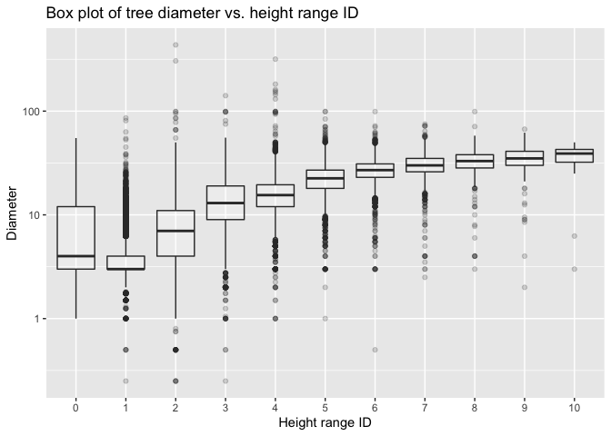

Milestone2
================
pattiey

# Pattie Ye’s Mini Data Analysis: Milestone 2

First load the libraries

``` r
library(datateachr)
library(tidyverse)
# I need the lubridate package to efficiently extract the date
library(lubridate)
# I need the ggridges package
library(ggridges)
```

# Task 1: Process and summarize data

## 1.1: My research questions

Research questions are changed from milestone 1 to be more specific.

1.  How has the frequency of trees planted by neighbourhood changed over
    time? And on a broader scale, how has it changed by decade? This
    could reflect the rate of development of certain neighbourhoods over
    time.

2.  Is there a difference in the frequency of certain species of trees
    between neighbourhoods? What is the most popular species of tree
    within Vancouver and which neighbourhoods are these trees mostly
    found?

3.  How does the number of trees planted change depending on the season?

4.  Is there a relationship between the height and width of trees? Are
    these trees found in geographically similar areas or are they
    scattered throughout the city?

## 1.2 Summarizing and graphing

### Research Question 1

*How has the frequency of trees planted by neighbourhood changed over
time? And on a broader scale, how has it changed by decade? This could
reflect the rate of development of certain neighbourhoods over time.*

From Milestone 1, I created a variable called `year_planted` that
contains the year in which a tree was planted.

``` r
vancouver_trees <- vancouver_trees %>% 
  # use year() from lubridate to extract year from date
  mutate(year_planted = year(date_planted))
```

I just want the decade in which these trees were planted in order to get
a better sense of overall trends over time. Create a categorical
variable based on `year_planted`.

``` r
vancouver_trees <- vancouver_trees %>% 
  mutate(decade_planted = cut(year_planted, breaks = c(1990, 2000, 2010, 2020), labels = c("90's", "00's", "10's"))) 
```

I now want to see the count of trees planted per decade by
neighbourhood.

``` r
vancouver_trees %>% 
  group_by(neighbourhood_name, decade_planted) %>% 
  summarise(count = n())
```

    ## `summarise()` has grouped output by 'neighbourhood_name'. You can override using the `.groups` argument.

    ## # A tibble: 88 × 3
    ## # Groups:   neighbourhood_name [22]
    ##    neighbourhood_name decade_planted count
    ##    <chr>              <fct>          <int>
    ##  1 ARBUTUS-RIDGE      90's             826
    ##  2 ARBUTUS-RIDGE      00's            1176
    ##  3 ARBUTUS-RIDGE      10's             535
    ##  4 ARBUTUS-RIDGE      <NA>            2632
    ##  5 DOWNTOWN           90's             569
    ##  6 DOWNTOWN           00's            1179
    ##  7 DOWNTOWN           10's             464
    ##  8 DOWNTOWN           <NA>            2947
    ##  9 DUNBAR-SOUTHLANDS  90's            1111
    ## 10 DUNBAR-SOUTHLANDS  00's            1631
    ## # … with 78 more rows

Most of the trees do not contain information on `date_planted`. From the
trees with date information, we see that most neighbourhoods saw the
greatest number of trees planted between 2000-2010. This may suggest
that the decade of 2000-2010 saw the greatest increase in development,
but with large number of entries without date information, it is
difficult to tell.

I would like to see the distribution of the rate of trees being planted
(number of trees planted in a year) in a given neighbourhood and how
that distribution changes depending on the decade.

First, plot a histogram with `binwidth = 10`

``` r
vancouver_trees %>% 
  group_by(year_planted, neighbourhood_name, decade_planted) %>% 
  summarise(annual_trees_planted = n()) %>% 
  # omit trees that do not have date planted information 
  filter(!is.na(decade_planted)) %>%  
  ggplot(aes(annual_trees_planted, fill = decade_planted, color = decade_planted)) +
  geom_histogram(position = "dodge", alpha = 0.2, aes(y = ..density..), binwidth = 10) +
  labs(fill = "Decade Planted", color = "Decade Planted", title = "Density distribution of annual number of trees planted, bin = 10", x = "Number of trees planted in a given year")
```

    ## `summarise()` has grouped output by 'year_planted', 'neighbourhood_name'. You can override using the `.groups` argument.

<!-- -->

Now with `binwidth = 25`

``` r
vancouver_trees %>% 
  group_by(year_planted, neighbourhood_name, decade_planted) %>% 
  summarise(annual_trees_planted = n()) %>% 
  # omit trees that do not have date planted information 
  filter(!is.na(decade_planted)) %>%  
  ggplot(aes(annual_trees_planted, fill = decade_planted, color = decade_planted)) +
  geom_histogram(position = "dodge", alpha = 0.2, aes(y = ..density..), binwidth = 25) +
  labs(fill = "Decade Planted", color = "Decade Planted", title = "Density distribution of annual number of trees planted, bin = 25", x = "Number of trees planted in a given year")
```

    ## `summarise()` has grouped output by 'year_planted', 'neighbourhood_name'. You can override using the `.groups` argument.

<!-- -->

Finally, plot a histogram with `binwidth = 50`

``` r
vancouver_trees %>% 
  group_by(year_planted, neighbourhood_name, decade_planted) %>% 
  summarise(annual_trees_planted = n()) %>% 
  # omit trees that do not have date planted information 
  filter(!is.na(decade_planted)) %>%  
  ggplot(aes(annual_trees_planted, fill = decade_planted, color = decade_planted)) +
  geom_histogram(position = "dodge", alpha = 0.2, aes(y = ..density..), binwidth = 50) +
  labs(fill = "Decade Planted", color = "Decade Planted", title = "Density distribution of annual number of trees planted, bin = 50", x = "Number of trees planted in a given year")
```

    ## `summarise()` has grouped output by 'year_planted', 'neighbourhood_name'. You can override using the `.groups` argument.

<!-- -->

The histogram with `binwidth = 10` produces a graph where it is hard to
see the differences between the decades and is difficult to extract
anything meaningful from it. `binwidth = 50` does not give a great
overview of the differences in distribution since the bins are quite
wide. `binwidth = 25` provides a happy medium where you can get a sense
of the distribution of the data without it being too difficult to read.
Overlaying `geom_density()` gives an even better sense of the
differences in distributions between the three decades.

``` r
vancouver_trees %>% 
  group_by(year_planted, neighbourhood_name, decade_planted) %>% 
  summarise(annual_trees_planted = n()) %>% 
  # omit trees that do not have date planted information 
  filter(!is.na(decade_planted)) %>%  
  ggplot(aes(annual_trees_planted, fill = decade_planted, color = decade_planted)) +
  geom_histogram(position = "dodge", alpha = 0.2, aes(y = ..density..), binwidth = 25) +
  geom_density(alpha = 0.3) + 
  labs(fill = "Decade Planted", color = "Decade Planted", title = "Density distribution of annual number of trees planted in a neighbourhood", x = "Number of trees planted in a given year")
```

    ## `summarise()` has grouped output by 'year_planted', 'neighbourhood_name'. You can override using the `.groups` argument.

<!-- -->

From this we see that the average rate of trees being planted per
neighbourhood during the 2010’s is lower than in the 1990’s and 2000’s.
The 2000’s saw the greatest average number of trees planted per year per
neighbourhood.

### Research Question 2

*Is there a difference in the frequency of certain species of trees
between neighbourhoods? What is the most popular species of tree within
Vancouver and which neighbourhoods are these trees mostly found?*

First, we shall look at summary statistics of the number of trees per
type of tree in each neighbourhood. For each neighbourhood, find the
mean, the median, min, and max number of trees per type, the most
popular type of tree, and the total number of trees.

``` r
vancouver_trees %>% 
  group_by(common_name, neighbourhood_name) %>% 
  # get a count of trees of each type per neighbourhood
  summarise(spec_count = n()) %>% 
  group_by(neighbourhood_name) %>% 
  arrange(desc(spec_count)) %>% 
  # names aren't as descriptive as I'd like in order to fit in the document
  summarise(mean = mean(spec_count), 
            median = median(spec_count), 
            min = min(spec_count), 
            max = max(spec_count),
            pop_tree = first(common_name), 
            total = sum(spec_count))
```

    ## `summarise()` has grouped output by 'common_name'. You can override using the `.groups` argument.

    ## # A tibble: 22 × 7
    ##    neighbourhood_name        mean median   min   max pop_tree              total
    ##    <chr>                    <dbl>  <dbl> <int> <int> <chr>                 <int>
    ##  1 ARBUTUS-RIDGE             19.9    5.5     1   696 PISSARD PLUM           5169
    ##  2 DOWNTOWN                  30.7    7       1   486 RED MAPLE              5159
    ##  3 DUNBAR-SOUTHLANDS         25.9    5       1   754 KWANZAN FLOWERING CH…  9415
    ##  4 FAIRVIEW                  17.9    6       1   251 RED MAPLE              4002
    ##  5 GRANDVIEW-WOODLAND        21.6    5       1   452 KWANZAN FLOWERING CH…  6703
    ##  6 HASTINGS-SUNRISE          30.4    9       1   657 PISSARD PLUM          10547
    ##  7 KENSINGTON-CEDAR COTTAGE  34.2    9       1   739 KWANZAN FLOWERING CH… 11042
    ##  8 KERRISDALE                24.4    7       1   668 NORWAY MAPLE           6936
    ##  9 KILLARNEY                 25.9    7       1   676 CRIMEAN LINDEN         6148
    ## 10 KITSILANO                 24.2    5.5     1   874 NORWAY MAPLE           8115
    ## # … with 12 more rows

From this summary, we can get a general sense of which trees are most
popular overall in the city (Kwanzan Flowering Cherry, Red Maple, Norway
Maple). We can also tell that the distributions of numbers of trees per
type is generally quite right-skewed (mean is greater than the median)
which suggests that for most types of trees in each neighbourhood there
are only a couple trees planted, while the popular trees are great in
numbers.

Now we look at the ten most popular types of trees in the city overall
and see how the number of each of those trees per neighbourhood varies
using a jitter plot overlaid with a violin plot.

``` r
# first get the ten most popular trees in Vancouver
(most_pop_trees <- vancouver_trees %>% 
  group_by(common_name) %>% 
  summarise(spec_count = n()) %>% 
  arrange(desc(spec_count)) %>% 
  pull(common_name) %>% 
  head(10))
```

    ##  [1] "KWANZAN FLOWERING CHERRY"    "PISSARD PLUM"               
    ##  [3] "NORWAY MAPLE"                "CRIMEAN LINDEN"             
    ##  [5] "PYRAMIDAL EUROPEAN HORNBEAM" "NIGHT PURPLE LEAF PLUM"     
    ##  [7] "RED MAPLE"                   "KOBUS MAGNOLIA"             
    ##  [9] "BOWHALL RED MAPLE"           "AKEBONO FLOWERING CHERRY"

``` r
vancouver_trees %>% 
  # filter to keep only the most popular trees
  filter(common_name %in% most_pop_trees) %>% 
  group_by(common_name, neighbourhood_name) %>% 
  summarise(spec_count = n()) %>% 
  # Have tree names as a factor so that the graph is in order of popularity
  ggplot(aes(factor(common_name, levels = most_pop_trees), spec_count, color = common_name, fill = common_name)) +
  # jitter plot, we want to plot the actual number of trees, so eliminate vertical jitter
  geom_jitter(height = 0) +
  geom_violin(alpha = 0.2) +
  # Do not include legend since it is redundant
  theme(legend.position = "none") +
  labs(title = "Per neighbourhood count of most \npopular trees across Vancouver", 
       x = "Common name of tree", 
       y = "Count by neighbourhood") +
  coord_flip()
```

    ## `summarise()` has grouped output by 'common_name'. You can override using the `.groups` argument.

<!-- -->

From this graph, we see that some types of trees such as the Kwanzan
Flowering Cherry are quite popular across a number of neighbourhoods,
while others such as the Red Maple are generally not as popular, but are
prominent in a few neighbourhoods.

### Research Question 3

*How does the number of trees planted change depending on the season?*

We need to create a categorical variable `season_planted`. The value of
the variable will be assigned as so:

| `season_planted` | Months                         |
|------------------|--------------------------------|
| `winter`         | Dec. (12), Jan. (1), Feb. (2)  |
| `spring`         | Mar. (3), Apr. (4), May (5)    |
| `summer`         | Jun. (6), Jul. (7), Aug. (8)   |
| `autumn`         | Sep. (9), Oct. (10), Nov. (11) |

``` r
vancouver_trees <- vancouver_trees %>% 
  mutate(season_planted = case_when(
    month(date_planted) %in% 3:5 ~ "Spring",
    month(date_planted) %in% 6:8 ~ "Summer",
    month(date_planted) %in% 9:11 ~ "Autumn",
    is.na(month(date_planted)) ~ "NA",
    # if the month is not in any of those other ranges, it must be Winter
    TRUE ~ "Winter"
  ))

vancouver_trees %>% 
  group_by(season_planted) %>% 
  summarise(count = n())
```

    ## # A tibble: 5 × 2
    ##   season_planted count
    ##   <chr>          <int>
    ## 1 Autumn         14999
    ## 2 NA             76548
    ## 3 Spring         20663
    ## 4 Summer           773
    ## 5 Winter         33628

Most of the trees do not have date information. From the trees that do
have `date_planted` information, it is shown that Winter is the most
popular season for trees to be planted, followed by Spring, Autumn, and
lastly (by a lot) Summer.

Here, we plot the distribution of trees planted by date coloured by
their season.

Start with `binwidth = 1`, each bin is one day.

``` r
vancouver_trees %>% 
  # Filter out trees without date information
  filter(!is.na(date_planted)) %>% 
  # Extract just the day of the year from date_planted
  mutate(day = yday(date_planted)) %>% 
  ggplot(aes(day, fill = season_planted)) + 
  geom_histogram(binwidth = 1) + 
  labs(x = "Day of the year", 
       fill = "Season planted", 
       title = "Distribution of trees planted \nby day of the year, binwidth = 1")
```

<!-- --> From
this, we see that there is one day in Autumn that appears to be an
outlier with close to 800 trees planted in a single day. We also see
that towards the Summer, as the weather starts getting warmer, tree
planting slows down.

Now plot with `binwidth = 7`. Each bin is a week.

``` r
vancouver_trees %>% 
  # Filter out trees without date information
  filter(!is.na(date_planted)) %>% 
  # Extract just the day of the year from date_planted
  mutate(day = yday(date_planted)) %>% 
  ggplot(aes(day, fill = season_planted)) + 
  geom_histogram(binwidth = 7) + 
  labs(x = "Day of the year", 
       fill = "Season planted", 
       title = "Distribution of trees planted \nby day of the year, binwidth = 7")
```

<!-- -->

From this histogram we see that the busiest weeks of the year for tree
planting are between Winter and Spring, and late Autumn. It is also
interesting to see that during the week surrounding the holiday season
in late December/early January, we see a dramatic decrease in the number
of trees planted. This histogram is a bit smoother and easier to read.

Now plot with `bins = 12`. Each bin roughly represents one month.

``` r
vancouver_trees %>% 
  # Filter out trees without date information
  filter(!is.na(date_planted)) %>% 
  # Extract just the day of the year from date_planted
  mutate(day = yday(date_planted)) %>% 
  ggplot(aes(day, fill = season_planted)) + 
  geom_histogram(bins = 12) + 
  labs(x = "Day of the year", 
       fill = "Season planted", 
       title = "Distribution of trees planted \nby day of the year, bins = 12")
```

<!-- -->

From this histogram, we see that February, March/April, and
November/December are the busiest months for tree planting. Although,
this graph does not cleanly divide up the months, if we are looking for
the trees by month, it would be better to directly plot a histogram
using the month.

``` r
vancouver_trees %>% 
  # Filter out trees without date information
  filter(!is.na(date_planted)) %>% 
  # Extract just the day of the year from date_planted
  mutate(month = month(date_planted)) %>% 
  ggplot(aes(month, fill = season_planted)) + 
  geom_histogram(binwidth = 1) + 
  labs(x = "Month planted", 
       fill = "Season planted", 
       title = "Distribution of trees planted \nby month")
```

<!-- -->

Here, see that the busiest tree planting months are actually January,
February, March, and November, which is difficult to tell from the
previous histogram.

The most informative histogram in this case would be that one with
`binwidth = 7` since it is smoother than the first histogram, eliminates
the effect of the outlying day, while also being able to show
interesting trends in planting such as the decrease surrounding the
holiday season and the steady decrease and increase in planting
surrounding the Summer.

### Research Question 4

*Is there a relationship between the height and width of trees? Are
these trees found in geographically similar areas or are they scattered
throughout the city?*

Since `height_range_id` is an ID variable, it can be viewed as a
categorical variable. Let’s look at the summary statistics of `diameter`
across the different `height_range_id` values.

For each `height_range_id` find the range, mean, median, first and third
quartile values, as well as what type of tree the thinnest and thickest
tree are.

``` r
vancouver_trees %>% 
  group_by(height_range_id) %>% 
  summarise(min = min(diameter), 
            first_q = quantile(diameter, probs = 0.25), 
            median = median(diameter), 
            mean = mean(diameter), 
            third_q = quantile(diameter, probs = 0.75), 
            max = max(diameter))
```

    ## # A tibble: 11 × 7
    ##    height_range_id   min first_q median  mean third_q   max
    ##              <dbl> <dbl>   <dbl>  <dbl> <dbl>   <dbl> <dbl>
    ##  1               0   0       0      3    5.41     6      55
    ##  2               1   0       3      3    3.92     4      86
    ##  3               2   0       4      7    8.38    11     435
    ##  4               3   0       9     13   14.6     19     141
    ##  5               4   1      12     15.5 16.6     19.5   317
    ##  6               5   1      18     22.5 22.8     27      99
    ##  7               6   0      23     27   27.3     31      99
    ##  8               7   2.5    26     30   30.8     35      75
    ##  9               8   3      28.3   33   33.3     38      99
    ## 10               9   2      30     35   34.8     41      67
    ## 11              10   3      32.5   39   34.1     42.8    50

``` r
# For visual purposes, thinnest and thickest types are separate
vancouver_trees %>% 
  group_by(height_range_id) %>%
  arrange(diameter) %>% 
  summarise(thinnest_type = first(common_name), thickest_type = last(common_name))
```

    ## # A tibble: 11 × 3
    ##    height_range_id thinnest_type            thickest_type                 
    ##              <dbl> <chr>                    <chr>                         
    ##  1               0 QUEEN ELIZABETH MAPLE    PERSIAN IRONWOOD              
    ##  2               1 COMMON LILAC             PYRAMIDAL EUROPEAN HORNBEAM   
    ##  3               2 WORPLESDON SWEETGUM      JAPANESE SNOWBELL             
    ##  4               3 MAGNOLIA 'GALAXY'        KWANZAN FLOWERING CHERRY      
    ##  5               4 NORWAY MAPLE             MAPLE SPECIES                 
    ##  6               5 DAWYCK'S BEECH           LAWSON CYPRESS/PORT ORFORD CED
    ##  7               6 NORWAY MAPLE             WESTERN RED CEDAR             
    ##  8               7 CHANTICLEER PEAR         GIANT SEQUOIA                 
    ##  9               8 AUTUMN BLAZE RED MAPLE   AMERICAN CHESTNUT             
    ## 10               9 INGES RUBY VASE IRONWOOD WESTERN RED CEDAR             
    ## 11              10 GLOBE OR MOPHEAD ACACIA  RED OAK

Based on the median and mean values, it appears that a higher
`height_range_id` corresponds to thicker trees. But it is interesting to
note that the maximum tree diameters belong in `height_range_id` 3, 4,
and 5. There doesn’t seem to be a clear explanation for these outliers
since they are much greater than the other diameter values. Perhaps
there was a recording error.

Here, we plot the diameter against `height_range_id` using a jitter
plot.

``` r
vancouver_trees %>% ggplot(aes(factor(height_range_id, levels = 1:10), diameter)) + geom_jitter(height = 0, alpha = 0.1) + labs(y = "Diameter", x = "Height range ID", title = "Tree diameter vs. Height range ID")
```

<!-- -->

This is extremely difficult to read. Use a
*l**o**g*<sub>10</sub>
transform on the y-axis.

``` r
vancouver_trees %>% ggplot(aes(factor(height_range_id, levels = 1:10), diameter)) + geom_jitter(height = 0, alpha = 0.2) + scale_y_continuous(trans = 'log10') + labs(y = "Diameter", x = "Height range ID", title = "Tree diameter vs. Height range ID")
```

    ## Warning: Transformation introduced infinite values in continuous y-axis

    ## Warning: Removed 92 rows containing missing values (geom_point).

<!-- --> This
still is not great, but is better. You can see that as the
`height_range_id` increases, the number of smaller diameter trees
decreases. Perhaps using a box plot will give something more
interpretable.

``` r
vancouver_trees %>% 
  ggplot(aes(factor(height_range_id, levels = 1:10), diameter)) + 
  geom_boxplot(alpha = 0.2) + 
  scale_y_continuous(trans = 'log10') + 
  labs(y = "Diameter", 
       x = "Height range ID", 
       title = "Box plot of tree diameter vs. height range ID")
```

    ## Warning: Transformation introduced infinite values in continuous y-axis

    ## Warning: Removed 92 rows containing non-finite values (stat_boxplot).

<!-- -->

Indeed it does. From this, it is clear that as the height increases, the
average tree diameter also increases.

## 1.3 Assess research questions
