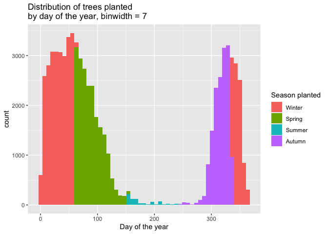

Mini Data-Analysis Deliverable 3
================

# Welcome to your last milestone in your mini data analysis project!

In Milestone 1, you explored your data and came up with research
questions. In Milestone 2, you obtained some results by making summary
tables and graphs.

In this (3rd) milestone, you’ll be sharpening some of the results you
obtained from your previous milestone by:

-   Manipulating special data types in R: factors and/or dates and
    times.
-   Fitting a model object to your data, and extract a result.
-   Reading and writing data as separate files.

**NOTE**: The main purpose of the mini data analysis is to integrate
what you learn in class in an analysis. Although each milestone provides
a framework for you to conduct your analysis, it’s possible that you
might find the instructions too rigid for your data set. If this is the
case, you may deviate from the instructions – just make sure you’re
demonstrating a wide range of tools and techniques taught in this class.

## Instructions

**To complete this milestone**, edit [this very `.Rmd`
file](https://raw.githubusercontent.com/UBC-STAT/stat545.stat.ubc.ca/master/content/mini-project/mini-project-3.Rmd)
directly. Fill in the sections that are tagged with
`<!--- start your work here--->`.

**To submit this milestone**, make sure to knit this `.Rmd` file to an
`.md` file by changing the YAML output settings from
`output: html_document` to `output: github_document`. Commit and push
all of your work to your mini-analysis GitHub repository, and tag a
release on GitHub. Then, submit a link to your tagged release on canvas.

**Points**: This milestone is worth 40 points (compared to the usual 30
points): 30 for your analysis, and 10 for your entire mini-analysis
GitHub repository. Details follow.

**Research Questions**: In Milestone 2, you chose two research questions
to focus on. Wherever realistic, your work in this milestone should
relate to these research questions whenever we ask for justification
behind your work. In the case that some tasks in this milestone don’t
align well with one of your research questions, feel free to discuss
your results in the context of a different research question.

# Setup

Begin by loading your data and the tidyverse package below:

``` r
library(datateachr) # <- might contain the data you picked!
library(tidyverse)
```

From Milestone 2, you chose two research questions. What were they? Put
them here.

<!-------------------------- Start your work below ---------------------------->

1.  *How has the frequency of trees planted by neighbourhood changed
    over time? Which neighbourhoods saw the greatest rate of trees
    planted per decade? Are there any neighbourhoods that have only
    recently seen a high rate of tree planting (last 5 years?) and
    conversely, are there any neighbourhoods that have drastically
    slowed down in their rate of tree planting?*
2.  *Is there a relationship between the height and width of trees? Are
    these larger trees found in geographically similar areas or are they
    scattered throughout the city? Alternatively, is there a
    relationship between age and the diameter of tree?*
    <!----------------------------------------------------------------------------->

# Exercise 1: Special Data Types (10)

For this exercise, you’ll be choosing two of the three tasks below –
both tasks that you choose are worth 5 points each.

But first, tasks 1 and 2 below ask you to modify a plot you made in a
previous milestone. The plot you choose should involve plotting across
at least three groups (whether by facetting, or using an aesthetic like
colour). Place this plot below (you’re allowed to modify the plot if
you’d like). If you don’t have such a plot, you’ll need to make one.
Place the code for your plot below.

<!-------------------------- Start your work below ---------------------------->

For this task, I would like to use the histogram plot of number of trees
planted by day of the year, contained in the work for research question
3 of Milestone 2. This graph colours by season planted.

First, load the necessary packages.

``` r
library(lubridate)
```

    ## 
    ## Attaching package: 'lubridate'

    ## The following objects are masked from 'package:base':
    ## 
    ##     date, intersect, setdiff, union

``` r
library(broom) # Used later in this milestone
```

Create the `season_planted` categorical variable.

``` r
vancouver_trees <- vancouver_trees %>% 
  mutate(season_planted = case_when(
    month(date_planted) %in% 3:5 ~ "Spring",
    month(date_planted) %in% 6:8 ~ "Summer",
    month(date_planted) %in% 9:11 ~ "Autumn",
    is.na(month(date_planted)) ~ "NA",
    # if the month is not in any of those other ranges, it must be Winter
    TRUE ~ "Winter"
  ))

vancouver_trees %>% 
  group_by(season_planted) %>% 
  summarise(count = n())
```

    ## # A tibble: 5 × 2
    ##   season_planted count
    ##   <chr>          <int>
    ## 1 Autumn         14999
    ## 2 NA             76548
    ## 3 Spring         20663
    ## 4 Summer           773
    ## 5 Winter         33628

Now the histogram plot of the number of trees planted each day of the
year, coloured by season with a binwidth of 7

``` r
vancouver_trees %>% 
  # Filter out trees without date information
  filter(!is.na(date_planted)) %>% 
  # Extract just the day of the year from date_planted
  mutate(day = yday(date_planted)) %>% 
  ggplot(aes(day, fill = season_planted)) + 
  geom_histogram(binwidth = 7) + 
  labs(x = "Day of the year", 
       fill = "Season planted", 
       title = "Distribution of trees planted \nby day of the year, binwidth = 7")
```

<!-- -->

<!----------------------------------------------------------------------------->

Now, choose two of the following tasks.

1.  Produce a new plot that reorders a factor in your original plot,
    using the `forcats` package (3 points). Then, in a sentence or two,
    briefly explain why you chose this ordering (1 point here for
    demonstrating understanding of the reordering, and 1 point for
    demonstrating some justification for the reordering, which could be
    subtle or speculative.)

2.  Produce a new plot that groups some factor levels together into an
    “other” category (or something similar), using the `forcats` package
    (3 points). Then, in a sentence or two, briefly explain why you
    chose this grouping (1 point here for demonstrating understanding of
    the grouping, and 1 point for demonstrating some justification for
    the grouping, which could be subtle or speculative.)

3.  If your data has some sort of time-based column like a date (but
    something more granular than just a year):

    1.  Make a new column that uses a function from the `lubridate` or
        `tsibble` package to modify your original time-based column. (3
        points)
        -   Note that you might first have to *make* a time-based column
            using a function like `ymd()`, but this doesn’t count.
        -   Examples of something you might do here: extract the day of
            the year from a date, or extract the weekday, or let 24
            hours elapse on your dates.
    2.  Then, in a sentence or two, explain how your new column might be
        useful in exploring a research question. (1 point for
        demonstrating understanding of the function you used, and 1
        point for your justification, which could be subtle or
        speculative).
        -   For example, you could say something like “Investigating the
            day of the week might be insightful because penguins don’t
            work on weekends, and so may respond differently”.

<!-------------------------- Start your work below ---------------------------->

**Task Number 1**: I will reorder the `season_planted` using
`fct_reorder` based on the minimum `yday` transformed `date_planted`
variable of each season. Based on this, the resulting ordering of
`season_planted` should be `Winter`, `Spring`, `Summer`, `Autumn`, then
`NA` since that is the chronological ordering of the seasons.

``` r
# First cast `season_planted` as a factor
vancouver_trees <- vancouver_trees %>% mutate(season_planted = factor(season_planted))
levels(vancouver_trees$season_planted)
```

    ## [1] "Autumn" "NA"     "Spring" "Summer" "Winter"

``` r
vancouver_trees <- vancouver_trees %>% mutate(season_planted = fct_reorder(season_planted, yday(date_planted), min))
```

Now plot the histogram again. This time, the ordering of the legend
should reflect the new ordering of `season_planted`

``` r
vancouver_trees %>% 
  # Filter out trees without date information
  filter(!is.na(date_planted)) %>% 
  # Extract just the day of the year from date_planted
  mutate(day = yday(date_planted)) %>% 
  ggplot(aes(day, fill = season_planted)) + 
  geom_histogram(binwidth = 7) + 
  labs(x = "Day of the year", 
       fill = "Season planted", 
       title = "Distribution of trees planted \nby day of the year, binwidth = 7")
```

<!-- -->
<!----------------------------------------------------------------------------->

<!-------------------------- Start your work below ---------------------------->

**Task Number 3**: I will be using the `year()` function from lubridate
to extract the year from the `date_planted` variable in order to answer
research question 1. I need the year from the date in order to be able
to group by year to explore the annual number of trees planted per
neighbourhood. This will also come in handy for research question 2 in
order to measure the age of a tree in years.

``` r
vancouver_trees <- vancouver_trees %>% 
  mutate(year_planted = year(date_planted))
```

(In the previous task, I also used `yday()` from lubridate to extract
the day of the year from the date in order to find the distribution of
trees planted each day, although I did not create a new variable in the
dataset with this)

<!----------------------------------------------------------------------------->

# Exercise 2: Modelling

## 2.0 (no points)

Pick a research question, and pick a variable of interest (we’ll call it
“Y”) that’s relevant to the research question. Indicate these.

<!-------------------------- Start your work below ---------------------------->

**Research Question**: I will explore the last part of the second
research question *Is there a relationship between age and the diameter
of tree?*

**Variable of interest**: diameter

<!----------------------------------------------------------------------------->

## 2.1 (5 points)

Fit a model or run a hypothesis test that provides insight on this
variable with respect to the research question. Store the model object
as a variable, and print its output to screen. We’ll omit having to
justify your choice, because we don’t expect you to know about model
specifics in STAT 545.

-   **Note**: It’s OK if you don’t know how these models/tests work.
    Here are some examples of things you can do here, but the sky’s the
    limit.
    -   You could fit a model that makes predictions on Y using another
        variable, by using the `lm()` function.
    -   You could test whether the mean of Y equals 0 using `t.test()`,
        or maybe the mean across two groups are different using
        `t.test()`, or maybe the mean across multiple groups are
        different using `anova()` (you may have to pivot your data for
        the latter two).
    -   You could use `lm()` to test for significance of regression.

<!-------------------------- Start your work below ---------------------------->

I will create a linear model to explore the relationship between a
tree’s age in days and its diameter.

``` r
# Find the age of a tree in days
vancouver_trees <- vancouver_trees %>% mutate(age_in_days = as.numeric(Sys.Date() - date_planted, unit = "days"))

# Create linear model of diameter vs. age
(age_diameter_model <- lm(diameter ~ age_in_days, vancouver_trees))
```

    ## 
    ## Call:
    ## lm(formula = diameter ~ age_in_days, data = vancouver_trees)
    ## 
    ## Coefficients:
    ## (Intercept)  age_in_days  
    ##   0.7650117    0.0007712

This gives a linear model of the form diameter = 0.7650117 +
0.0007712\*(age\_in\_days), this suggests that for every one day
increase in age, you expect to see a 0.0007712 increase in diameter.

<!----------------------------------------------------------------------------->

## 2.2 (5 points)

Produce something relevant from your fitted model: either predictions on
Y, or a single value like a regression coefficient or a p-value.

-   Be sure to indicate in writing what you chose to produce.
-   Your code should either output a tibble (in which case you should
    indicate the column that contains the thing you’re looking for), or
    the thing you’re looking for itself.
-   Obtain your results using the `broom` package if possible. If your
    model is not compatible with the broom function you’re needing, then
    you can obtain your results by some other means, but first indicate
    which broom function is not compatible.

<!-------------------------- Start your work below ---------------------------->

In order to determine the significance of relationship between age and
tree diameter, look at the p-value corresponding to the coefficient for
`age_in_days` in the model.

``` r
# Convert model to tibble using tidy in broom
(model_tibble <- tidy(age_diameter_model))
```

    ## # A tibble: 2 × 5
    ##   term        estimate  std.error statistic  p.value
    ##   <chr>          <dbl>      <dbl>     <dbl>    <dbl>
    ## 1 (Intercept) 0.765    0.0422          18.1 3.00e-73
    ## 2 age_in_days 0.000771 0.00000607     127.  0

The p-value we are interested in is found under the `p.value` column in
the second row (where term == `age_in_days`). We see that this p-value
is 0, which means that this value is accepted at any significance level.
So, we cannot reject the hypothesis that there is a positive
relationship between the age of a tree and its diameter.
<!----------------------------------------------------------------------------->

# Exercise 3: Reading and writing data

Get set up for this exercise by making a folder called `output` in the
top level of your project folder / repository. You’ll be saving things
there.

## 3.1 (5 points)

Take a summary table that you made from Milestone 2 (Exercise 1.2), and
write it as a csv file in your `output` folder. Use the `here::here()`
function.

-   **Robustness criteria**: You should be able to move your Mini
    Project repository / project folder to some other location on your
    computer, or move this very Rmd file to another location within your
    project repository / folder, and your code should still work.
-   **Reproducibility criteria**: You should be able to delete the csv
    file, and remake it simply by knitting this Rmd file.

<!-------------------------- Start your work below ---------------------------->

I will take the summary table from research question 1 (number of trees
planted by decade and neighbourhood), and write it as a csv file.

``` r
#First I need to recreate the summary table
vancouver_trees <- vancouver_trees %>% 
  mutate(decade_planted = cut(year_planted, breaks = c(1990, 2000, 2010, 2020), labels = c("90's", "00's", "10's")))

vancouver_trees %>% 
  group_by(neighbourhood_name, decade_planted) %>% 
  summarise(count = n()) %>% 
  write.csv(here::here("output", "trees_planted_by_decade_neighbourhood.csv"))
```

    ## `summarise()` has grouped output by 'neighbourhood_name'. You can override using the `.groups` argument.

<!----------------------------------------------------------------------------->

## 3.2 (5 points)

Write your model object from Exercise 2 to an R binary file (an RDS),
and load it again. Be sure to save the binary file in your `output`
folder. Use the functions `saveRDS()` and `readRDS()`.

-   The same robustness and reproducibility criteria as in 3.1 apply
    here.

<!-------------------------- Start your work below ---------------------------->

Save `age_diameter_model` as an RDS.

``` r
file_name <- "age_diameter_model.rds"
age_diameter_model %>% saveRDS(here::here("output", file_name))
```

Load `age_diameter_model` from the RDS.

``` r
(age_diameter_model <- readRDS(here::here("output", file_name)))
```

    ## 
    ## Call:
    ## lm(formula = diameter ~ age_in_days, data = vancouver_trees)
    ## 
    ## Coefficients:
    ## (Intercept)  age_in_days  
    ##   0.7650117    0.0007712

<!----------------------------------------------------------------------------->

# Tidy Repository

Now that this is your last milestone, your entire project repository
should be organized. Here are the criteria we’re looking for.

## Main README (3 points)

There should be a file named `README.md` at the top level of your
repository. Its contents should automatically appear when you visit the
repository on GitHub.

Minimum contents of the README file:

-   In a sentence or two, explains what this repository is, so that
    future-you or someone else stumbling on your repository can be
    oriented to the repository.
-   In a sentence or two (or more??), briefly explains how to engage
    with the repository. You can assume the person reading knows the
    material from STAT 545A. Basically, if a visitor to your repository
    wants to explore your project, what should they know?

Once you get in the habit of making README files, and seeing more README
files in other projects, you’ll wonder how you ever got by without them!
They are tremendously helpful.

## File and Folder structure (3 points)

You should have at least four folders in the top level of your
repository: one for each milestone, and one output folder. If there are
any other folders, these are explained in the main README.

Each milestone document is contained in its respective folder, and
nowhere else.

Every level-1 folder (that is, the ones stored in the top level, like
“Milestone1” and “output”) has a `README` file, explaining in a sentence
or two what is in the folder, in plain language (it’s enough to say
something like “This folder contains the source for Milestone 1”).

## Output (2 points)

All output is recent and relevant:

-   All Rmd files have been `knit`ted to their output, and all data
    files saved from Exercise 3 above appear in the `output` folder.
-   All of these output files are up-to-date – that is, they haven’t
    fallen behind after the source (Rmd) files have been updated.
-   There should be no relic output files. For example, if you were
    knitting an Rmd to html, but then changed the output to be only a
    markdown file, then the html file is a relic and should be deleted.

Our recommendation: delete all output files, and re-knit each
milestone’s Rmd file, so that everything is up to date and relevant.

PS: there’s a way where you can run all project code using a single
command, instead of clicking “knit” three times. More on this in STAT
545B!

## Error-free code (1 point)

This Milestone 3 document knits error-free. (We’ve already graded this
aspect for Milestone 1 and 2)

## Tagged release (1 point)

You’ve tagged a release for Milestone 3. (We’ve already graded this
aspect for Milestone 1 and 2)
