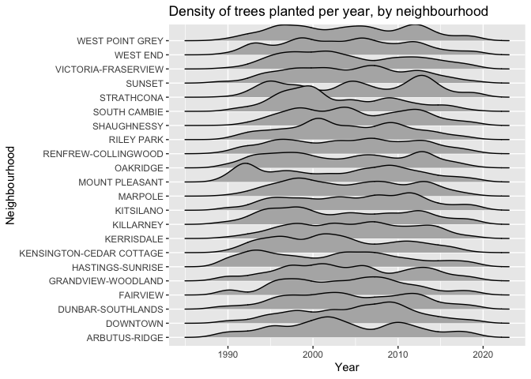
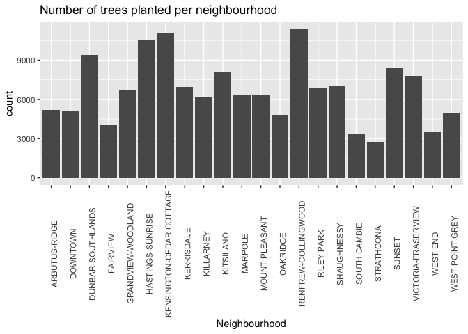
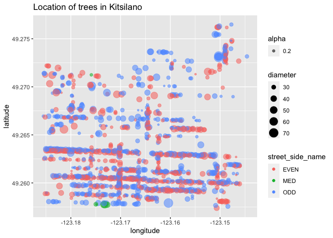
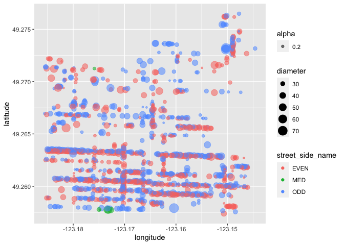

README
================
pattiey
04/10/2021

# Welcome to your (maybe) first-ever data analysis project!

And hopefully the first of many. Let’s get started:

1.  Install the [`datateachr`](https://github.com/UBC-MDS/datateachr)
    package by typing the following into your **R terminal**:

<!-- -->

    install.packages("devtools")
    devtools::install_github("UBC-MDS/datateachr")

2.  Load the packages below.

``` r
library(datateachr)
library(tidyverse)
```

    ## ── Attaching packages ─────────────────────────────────────── tidyverse 1.3.1 ──

    ## ✓ ggplot2 3.3.5     ✓ purrr   0.3.4
    ## ✓ tibble  3.1.5     ✓ dplyr   1.0.7
    ## ✓ tidyr   1.1.4     ✓ stringr 1.4.0
    ## ✓ readr   2.0.2     ✓ forcats 0.5.1

    ## ── Conflicts ────────────────────────────────────────── tidyverse_conflicts() ──
    ## x dplyr::filter() masks stats::filter()
    ## x dplyr::lag()    masks stats::lag()

3.  Make a repository in the <https://github.com/stat545ubc-2021>
    Organization. You will be working with this repository for the
    entire data analysis project. You can either make it public, or make
    it private and add the TA’s and Vincenzo as collaborators.

4.  When you go to submit, submit a URL to your repository to canvas.

# Instructions

More details regarding the instructions and points allocated to each
task can be found below. Briefly,

-   Each milestone is worth 30 points. The number of points allocated to
    each task will be annotated within each deliverable. Tasks that are
    more challenging will often be allocated more points.

-   10 points will be allocated to the reproducibility, cleanliness, and
    coherence of the analysis. While the three milestones will be
    submitted as independent deliverables, the analysis itself is a
    continuum - think of it as 3 chapters to a story. Each chapter, or
    in this case, portion of your analysis, should be easily followed
    through by someone unfamiliar with the content.
    [Here](https://swcarpentry.github.io/r-novice-inflammation/06-best-practices-R/)
    is a good resource for what constitutes “good code”. Learning good
    coding practices early in your career will save you hassle later on!

# Learning Objectives

By the end of this milestone, you should:

-   Become familiar with your dataset of choosing
-   Think of 4 questions that you would like to answer with your data
-   Generate a reproducible and clear report using R Markdown

# Task 1: Choose your favorite dataset (10 points)

The `datateachr` package by Hayley Boyce and Jordan Bourak currently
composed of 7 semi-tidy datasets for educational purposes. Here is a
brief description of each dataset:

-   *apt\_buildings*: Acquired courtesy of The City of Toronto’s Open
    Data Portal. It currently has 3455 rows and 37 columns.

-   *building\_permits*: Acquired courtesy of The City of Vancouver’s
    Open Data Portal. It currently has 20680 rows and 14 columns.

-   *cancer\_sample*: Acquired courtesy of UCI Machine Learning
    Repository. It currently has 569 rows and 32 columns.

-   *flow\_sample*: Acquired courtesy of The Government of Canada’s
    Historical Hydrometric Database. It currently has 218 rows and 7
    columns.

-   *parking\_meters*: Acquired courtesy of The City of Vancouver’s Open
    Data Portal. It currently has 10032 rows and 22 columns.

-   *steam\_games*: Acquired courtesy of Kaggle. It currently has 40833
    rows and 21 columns.

-   *vancouver\_trees*: Acquired courtesy of The City of Vancouver’s
    Open Data Portal. It currently has 146611 rows and 20 columns.

**Things to keep in mind**

-   We hope that this project will serve as practice for carrying our
    your own *independent* data analysis. Remember to comment your code,
    be explicit about what you are doing, and write notes in this
    markdown document when you feel that context is required. As you
    advance in the project, prompts and hints to do this will be
    diminished - it’ll be up to you!

-   Before choosing a dataset, you should always keep in mind **your
    goal**, or in other ways, *what you wish to achieve with this data*.
    This mini data-analysis project focuses on *data wrangling*,
    *tidying*, and *visualization*. In short, it’s a way for you to get
    your feet wet with exploring data on your own.

And that is exactly the first thing that you will do!

1.1 Out of the 7 datasets available in the `datateachr` package, choose
**4** that appeal to you based on their description. Write your choices
below:

**Note**: We encourage you to use the ones in the `datateachr` package,
but if you have a dataset that you’d really like to use, you can include
it here. But, please check with a member of the teaching team to see
whether the dataset is of appropriate complexity. Also, include a
**brief** description of the dataset here to help the teaching team
understand your data.

1: CHOICE\_1\_HERE  
2: CHOICE\_2\_HERE  
3: CHOICE\_3\_HERE  
4: CHOICE\_4\_HERE

1.2 One way to narrowing down your selection is to *explore* the
datasets. Use your knowledge of dplyr to find out at least *3*
attributes about each of these datasets (an attribute is something such
as number of rows, variables, class type…). The goal here is to have an
idea of *what the data looks like*.

*Hint:* This is one of those times when you should think about the
cleanliness of your analysis. I added a single code chunk for you, but
do you want to use more than one? Would you like to write more comments
outside of the code chunk?

``` r
### EXPLORE HERE ###
steam_games
```

    ## # A tibble: 40,833 × 21
    ##       id url    types name  desc_snippet recent_reviews all_reviews release_date
    ##    <dbl> <chr>  <chr> <chr> <chr>        <chr>          <chr>       <chr>       
    ##  1     1 https… app   DOOM  Now include… Very Positive… Very Posit… May 12, 2016
    ##  2     2 https… app   PLAY… PLAYERUNKNO… Mixed,(6,214)… Mixed,(836… Dec 21, 2017
    ##  3     3 https… app   BATT… Take comman… Mixed,(166),-… Mostly Pos… Apr 24, 2018
    ##  4     4 https… app   DayZ  The post-so… Mixed,(932),-… Mixed,(167… Dec 13, 2018
    ##  5     5 https… app   EVE … EVE Online … Mixed,(287),-… Mostly Pos… May 6, 2003 
    ##  6     6 https… bund… Gran… Grand Theft… NaN            NaN         NaN         
    ##  7     7 https… app   Devi… The ultimat… Very Positive… Very Posit… Mar 7, 2019 
    ##  8     8 https… app   Huma… Human: Fall… Very Positive… Very Posit… Jul 22, 2016
    ##  9     9 https… app   They… They Are Bi… Very Positive… Very Posit… Dec 12, 2017
    ## 10    10 https… app   Warh… In a world … <NA>           Mixed,(904… May 31, 2019
    ## # … with 40,823 more rows, and 13 more variables: developer <chr>,
    ## #   publisher <chr>, popular_tags <chr>, game_details <chr>, languages <chr>,
    ## #   achievements <dbl>, genre <chr>, game_description <chr>,
    ## #   mature_content <chr>, minimum_requirements <chr>,
    ## #   recommended_requirements <chr>, original_price <dbl>, discount_price <dbl>

1.3 Now that you’ve explored the 4 datasets that you were initially most
interested in, let’s narrow it down to 2. What lead you to choose these
2? Briefly explain your choices below, and feel free to include any code
in your explanation.

1.4 Time for the final decision! Going back to the beginning, it’s
important to have an *end goal* in mind. For example, if I had chosen
the `titanic` dataset for my project, I might’ve wanted to explore the
relationship between survival and other variables. Try to think of 1
research question that you would want to answer with each dataset. Note
them down below, and make your final choice based on what seems more
interesting to you!

# Important note

Read Tasks 2 and 3 *fully* before starting to complete either of them.
Probably also a good point to grab a coffee to get ready for the fun
part!

This project is semi-guided, but meant to be *independent*. For this
reason, you will complete tasks 2 and 3 below (under the **START HERE**
mark) as if you were writing your own exploratory data analysis report,
and this guidance never existed! Feel free to add a brief introduction
section to your project, format the document with markdown syntax as you
deem appropriate, and structure the analysis as you deem appropriate.
Remember, marks will be awarded for completion of the 4 tasks, but 10
points of the whole project are allocated to a reproducible and clean
analysis. If you feel lost, you can find a sample data analysis
[here](https://www.kaggle.com/headsortails/tidy-titarnic) to have a
better idea. However, bear in mind that it is **just an example** and
you will not be required to have that level of complexity in your
project.

# Task 2: Exploring your dataset (15 points)

If we rewind and go back to the learning objectives, you’ll see that by
the end of this deliverable, you should have formulated *4* research
questions about your data that you may want to answer during your
project. However, it may be handy to do some more exploration on your
dataset of choice before creating these questions - by looking at the
data, you may get more ideas. **Before you start this task, read all
instructions carefully until you reach START HERE**.

2.1 Complete *4 out of the following 8 exercises* to dive deeper into
your data. All datasets are different and therefore, not all of these
tasks may make sense for your data - which is why you should only answer
*4*. Use *dplyr* and *ggplot*.

1.  Plot the distribution of a numeric variable.
2.  Create a new variable based on other variables in your data (only if
    it makes sense)
3.  Investigate how many missing values there are per variable. Can you
    find a way to plot this?
4.  Explore the relationship between 2 variables in a plot.
5.  Filter observations in your data according to your own criteria.
    Think of what you’d like to explore - again, if this was the
    `titanic` dataset, I may want to narrow my search down to passengers
    born in a particular year…
6.  Use a boxplot to look at the frequency of different observations
    within a single variable. You can do this for more than one variable
    if you wish!
7.  Make a new tibble with a subset of your data, with variables and
    observations that you are interested in exploring.
8.  Use a density plot to explore any of your variables (that are
    suitable for this type of plot).

2.2 For each of the 4 exercises that you complete, provide a *brief
explanation* of why you chose that exercise in relation to your data (in
other words, why does it make sense to do that?), and sufficient
comments for a reader to understand your reasoning and code.

# Task 3: Write your research questions (5 points)

So far, you have chosen a dataset and gotten familiar with it through
exploring the data. Now it’s time to figure out 4 research questions
that you would like to answer with your data! Write the 4 questions and
any additional comments at the end of this deliverable. These questions
are not necessarily set in stone - TAs will review them and give you
feedback; therefore, you may choose to pursue them as they are for the
rest of the project, or make modifications!

<!--- *****START HERE***** --->

# Pattie Ye’s Mini Data Analysis

# Choosing a dataset from the `datateachr` package

From the 7 datasets in `datateachr` my top 4 choices are:

1.  `cancer_sample`: characteristics of cell nuclei from digitized
    images of breast mass

``` r
# Look at column names
names(cancer_sample)
```

    ##  [1] "ID"                      "diagnosis"              
    ##  [3] "radius_mean"             "texture_mean"           
    ##  [5] "perimeter_mean"          "area_mean"              
    ##  [7] "smoothness_mean"         "compactness_mean"       
    ##  [9] "concavity_mean"          "concave_points_mean"    
    ## [11] "symmetry_mean"           "fractal_dimension_mean" 
    ## [13] "radius_se"               "texture_se"             
    ## [15] "perimeter_se"            "area_se"                
    ## [17] "smoothness_se"           "compactness_se"         
    ## [19] "concavity_se"            "concave_points_se"      
    ## [21] "symmetry_se"             "fractal_dimension_se"   
    ## [23] "radius_worst"            "texture_worst"          
    ## [25] "perimeter_worst"         "area_worst"             
    ## [27] "smoothness_worst"        "compactness_worst"      
    ## [29] "concavity_worst"         "concave_points_worst"   
    ## [31] "symmetry_worst"          "fractal_dimension_worst"

``` r
# Dimensions
dim(cancer_sample)
```

    ## [1] 569  32

``` r
# Data class of each column
sapply(cancer_sample, class)
```

    ##                      ID               diagnosis             radius_mean 
    ##               "numeric"             "character"               "numeric" 
    ##            texture_mean          perimeter_mean               area_mean 
    ##               "numeric"               "numeric"               "numeric" 
    ##         smoothness_mean        compactness_mean          concavity_mean 
    ##               "numeric"               "numeric"               "numeric" 
    ##     concave_points_mean           symmetry_mean  fractal_dimension_mean 
    ##               "numeric"               "numeric"               "numeric" 
    ##               radius_se              texture_se            perimeter_se 
    ##               "numeric"               "numeric"               "numeric" 
    ##                 area_se           smoothness_se          compactness_se 
    ##               "numeric"               "numeric"               "numeric" 
    ##            concavity_se       concave_points_se             symmetry_se 
    ##               "numeric"               "numeric"               "numeric" 
    ##    fractal_dimension_se            radius_worst           texture_worst 
    ##               "numeric"               "numeric"               "numeric" 
    ##         perimeter_worst              area_worst        smoothness_worst 
    ##               "numeric"               "numeric"               "numeric" 
    ##       compactness_worst         concavity_worst    concave_points_worst 
    ##               "numeric"               "numeric"               "numeric" 
    ##          symmetry_worst fractal_dimension_worst 
    ##               "numeric"               "numeric"

2.  `vancouver_trees`: listing of public trees on boulevards in the City
    of Vancouver (146611 rows and 20 columns)

``` r
# Look at column names
names(vancouver_trees)
```

    ##  [1] "tree_id"            "civic_number"       "std_street"        
    ##  [4] "genus_name"         "species_name"       "cultivar_name"     
    ##  [7] "common_name"        "assigned"           "root_barrier"      
    ## [10] "plant_area"         "on_street_block"    "on_street"         
    ## [13] "neighbourhood_name" "street_side_name"   "height_range_id"   
    ## [16] "diameter"           "curb"               "date_planted"      
    ## [19] "longitude"          "latitude"

``` r
# Dimensions
dim(vancouver_trees)
```

    ## [1] 146611     20

``` r
# Data type of each column
sapply(vancouver_trees, class)
```

    ##            tree_id       civic_number         std_street         genus_name 
    ##          "numeric"          "numeric"        "character"        "character" 
    ##       species_name      cultivar_name        common_name           assigned 
    ##        "character"        "character"        "character"        "character" 
    ##       root_barrier         plant_area    on_street_block          on_street 
    ##        "character"        "character"          "numeric"        "character" 
    ## neighbourhood_name   street_side_name    height_range_id           diameter 
    ##        "character"        "character"          "numeric"          "numeric" 
    ##               curb       date_planted          longitude           latitude 
    ##        "character"             "Date"          "numeric"          "numeric"

3.  `flow_sample`: Maximum and minimum recorded mean daily flow recorded
    at the Bow River Station in Banff (218 rows and 7 columns)

``` r
# Look at column names
names(flow_sample)
```

    ## [1] "station_id"   "year"         "extreme_type" "month"        "day"         
    ## [6] "flow"         "sym"

``` r
# Dimensions
dim(flow_sample)
```

    ## [1] 218   7

``` r
# Data type of each column
sapply(flow_sample, class)
```

    ##   station_id         year extreme_type        month          day         flow 
    ##  "character"    "numeric"  "character"    "numeric"    "numeric"    "numeric" 
    ##          sym 
    ##  "character"

4.  `parking_meters`: information on rates and time limits for parking
    meters in the City of Vancouver (10032 rows and 22 columns)

``` r
# Look at column names
names(parking_meters)
```

    ##  [1] "meter_head"     "r_mf_9a_6p"     "r_mf_6p_10"     "r_sa_9a_6p"    
    ##  [5] "r_sa_6p_10"     "r_su_9a_6p"     "r_su_6p_10"     "rate_misc"     
    ##  [9] "time_in_effect" "t_mf_9a_6p"     "t_mf_6p_10"     "t_sa_9a_6p"    
    ## [13] "t_sa_6p_10"     "t_su_9a_6p"     "t_su_6p_10"     "time_misc"     
    ## [17] "credit_card"    "pay_phone"      "longitude"      "latitude"      
    ## [21] "geo_local_area" "meter_id"

``` r
# Dimensions
dim(parking_meters)
```

    ## [1] 10032    22

``` r
# Data type of each column
sapply(parking_meters, class)
```

    ##     meter_head     r_mf_9a_6p     r_mf_6p_10     r_sa_9a_6p     r_sa_6p_10 
    ##    "character"    "character"    "character"    "character"    "character" 
    ##     r_su_9a_6p     r_su_6p_10      rate_misc time_in_effect     t_mf_9a_6p 
    ##    "character"    "character"    "character"    "character"    "character" 
    ##     t_mf_6p_10     t_sa_9a_6p     t_sa_6p_10     t_su_9a_6p     t_su_6p_10 
    ##    "character"    "character"    "character"    "character"    "character" 
    ##      time_misc    credit_card      pay_phone      longitude       latitude 
    ##    "character"    "character"    "character"      "numeric"      "numeric" 
    ## geo_local_area       meter_id 
    ##    "character"    "character"

# Top 2 choices:

-   `vancouver_trees`
-   `flow_sample`

## `vancouver_trees`

``` r
# Looking at vancouver_trees to get an idea of values
glimpse(vancouver_trees)
```

    ## Rows: 146,611
    ## Columns: 20
    ## $ tree_id            <dbl> 149556, 149563, 149579, 149590, 149604, 149616, 149…
    ## $ civic_number       <dbl> 494, 450, 4994, 858, 5032, 585, 4909, 4925, 4969, 7…
    ## $ std_street         <chr> "W 58TH AV", "W 58TH AV", "WINDSOR ST", "E 39TH AV"…
    ## $ genus_name         <chr> "ULMUS", "ZELKOVA", "STYRAX", "FRAXINUS", "ACER", "…
    ## $ species_name       <chr> "AMERICANA", "SERRATA", "JAPONICA", "AMERICANA", "C…
    ## $ cultivar_name      <chr> "BRANDON", NA, NA, "AUTUMN APPLAUSE", NA, "CHANTICL…
    ## $ common_name        <chr> "BRANDON ELM", "JAPANESE ZELKOVA", "JAPANESE SNOWBE…
    ## $ assigned           <chr> "N", "N", "N", "Y", "N", "N", "N", "N", "N", "N", "…
    ## $ root_barrier       <chr> "N", "N", "N", "N", "N", "N", "N", "N", "N", "N", "…
    ## $ plant_area         <chr> "N", "N", "4", "4", "4", "B", "6", "6", "3", "3", "…
    ## $ on_street_block    <dbl> 400, 400, 4900, 800, 5000, 500, 4900, 4900, 4900, 7…
    ## $ on_street          <chr> "W 58TH AV", "W 58TH AV", "WINDSOR ST", "E 39TH AV"…
    ## $ neighbourhood_name <chr> "MARPOLE", "MARPOLE", "KENSINGTON-CEDAR COTTAGE", "…
    ## $ street_side_name   <chr> "EVEN", "EVEN", "EVEN", "EVEN", "EVEN", "ODD", "ODD…
    ## $ height_range_id    <dbl> 2, 4, 3, 4, 2, 2, 3, 3, 2, 2, 2, 5, 3, 2, 2, 2, 2, …
    ## $ diameter           <dbl> 10.00, 10.00, 4.00, 18.00, 9.00, 5.00, 15.00, 14.00…
    ## $ curb               <chr> "N", "N", "Y", "Y", "Y", "Y", "Y", "Y", "Y", "Y", "…
    ## $ date_planted       <date> 1999-01-13, 1996-05-31, 1993-11-22, 1996-04-29, 19…
    ## $ longitude          <dbl> -123.1161, -123.1147, -123.0846, -123.0870, -123.08…
    ## $ latitude           <dbl> 49.21776, 49.21776, 49.23938, 49.23469, 49.23894, 4…

``` r
# Look at how many unique values exist in each feature in vancouver_trees
vancouver_trees %>% sapply(unique) %>% sapply(length)
```

    ##            tree_id       civic_number         std_street         genus_name 
    ##             146611               8349                805                 97 
    ##       species_name      cultivar_name        common_name           assigned 
    ##                283                294                634                  2 
    ##       root_barrier         plant_area    on_street_block          on_street 
    ##                  2                 49                433                812 
    ## neighbourhood_name   street_side_name    height_range_id           diameter 
    ##                 22                  6                 11                520 
    ##               curb       date_planted          longitude           latitude 
    ##                  2               3995              77228              36685

``` r
# The height_range_id variable is ambiguous, look at what values it takes on 
unique(vancouver_trees$height_range_id)
```

    ##  [1]  2  4  3  5  1  6  0  7  9  8 10

``` r
# height range is between 0 and 10

# Look at all fields with only 2 unique values
unique(vancouver_trees$assigned)
```

    ## [1] "N" "Y"

``` r
unique(vancouver_trees$root_barrier)
```

    ## [1] "N" "Y"

``` r
unique(vancouver_trees$curb)
```

    ## [1] "N" "Y"

``` r
# They all seem to be Y/N (boolean) type features

# What is street side name describing?
unique(vancouver_trees$street_side_name)
```

    ## [1] "EVEN"     "ODD"      "MED"      "PARK"     "BIKE MED" "GREENWAY"

``` r
# Where on the street is the tree located on

# I'm not too sure what plant_area is. 
unique(vancouver_trees$plant_area)
```

    ##  [1] "N"  "4"  "B"  "6"  "3"  "5"  "2"  NA   "10" "C"  "7"  "8"  "12" "25" "40"
    ## [16] "9"  "17" "1"  "24" "11" "20" "13" "15" "16" "G"  "18" "b"  "14" "30" "c" 
    ## [31] "L"  "P"  "50" "34" "60" "M"  "21" "35" "n"  "75" "45" "19" "0"  "g"  "22"
    ## [46] "y"  "27" "32" "26"

`vancouver_trees` describes information about public trees planted on
boulevards in the City of Vancouver. This dataset interests me because
there are so many different types of information available, such as
location, type of tree, and date planted. With this data, I could answer
a variety of different questions, such as the location of trees planted
in Vancouver, or how the number of trees planted vary from year to year,
or how the trees vary physically depending on tree type.

## `flow_sample`

``` r
# Looking at flow_sample to get an idea of values 
glimpse(flow_sample)
```

    ## Rows: 218
    ## Columns: 7
    ## $ station_id   <chr> "05BB001", "05BB001", "05BB001", "05BB001", "05BB001", "0…
    ## $ year         <dbl> 1909, 1910, 1911, 1912, 1913, 1914, 1915, 1916, 1917, 191…
    ## $ extreme_type <chr> "maximum", "maximum", "maximum", "maximum", "maximum", "m…
    ## $ month        <dbl> 7, 6, 6, 8, 6, 6, 6, 6, 6, 6, 6, 7, 6, 6, 6, 7, 5, 7, 6, …
    ## $ day          <dbl> 7, 12, 14, 25, 11, 18, 27, 20, 17, 15, 22, 3, 9, 5, 14, 5…
    ## $ flow         <dbl> 314, 230, 264, 174, 232, 214, 236, 309, 174, 345, 185, 24…
    ## $ sym          <chr> NA, NA, NA, NA, NA, NA, NA, NA, NA, NA, NA, NA, NA, NA, N…

``` r
# How many unique values exist for each feature
flow_sample %>% sapply(unique) %>% sapply(length)
```

    ##   station_id         year extreme_type        month          day         flow 
    ##            1          109            2           11           32          171 
    ##          sym 
    ##            4

``` r
# Confirm that extreme_type is either max or min
unique(flow_sample$extreme_type)
```

    ## [1] "maximum" "minimum"

``` r
# How is it that there are 32 unique values for day
unique(flow_sample$day)
```

    ##  [1]  7 12 14 25 11 18 27 20 17 15 22  3  9  5 23 28  2  8 31 16  1 29 26 10 21
    ## [26] 30 24 19  6 13  4 NA

``` r
# there are NA values... how many?
sum(is.na(flow_sample$day))
```

    ## [1] 2

`flow_sample` contains information about the daily flow data for the Bow
River at Banff. Although the data is relatively simple, it can answer
many interesting questions. Some questions that can be answered are how
flow has changed over time, during what months do the extremes typically
happen.

# Final choice

`vancouver_trees` seems more interesting to play around with since there
are so many different types of features that can demonstrate a large
variety of information.

# Exploring My Dataset

I’m interested in seeing how the number of trees planted varies from
year to year, so I need a variable that contains only the year from
`date_planted` called `year_planted`

``` r
# I need the lubridate package to efficiently extract the date
library(lubridate)
```

    ## 
    ## Attaching package: 'lubridate'

    ## The following objects are masked from 'package:base':
    ## 
    ##     date, intersect, setdiff, union

``` r
vancouver_trees <- vancouver_trees %>% 
  mutate(year_planted = year(date_planted))
```

I would like to see how the number of trees planted changed year to year

``` r
ggplot(vancouver_trees, aes(year_planted)) + geom_density() + theme_classic() + xlab("Year") + ggtitle("Density of trees planted per year")
```

    ## Warning: Removed 76548 rows containing non-finite values (stat_density).

<!-- -->

I now want to see how that distribution changes by neighbourhood

``` r
# I need the ggridges package
library(ggridges)
ggplot(vancouver_trees, aes(x = year_planted, y = neighbourhood_name)) + geom_density_ridges() + xlab("Year") + ylab("Neighbourhood") + ggtitle("Density of trees planted per year, by neighbourhood")
```

    ## Picking joint bandwidth of 1.35

    ## Warning: Removed 76548 rows containing non-finite values (stat_density_ridges).

<!-- -->

I’d also like to see how many trees there are in each neighbourhood.

``` r
ggplot(vancouver_trees, aes(neighbourhood_name)) + geom_bar() + theme(axis.text.x = element_text(angle = 90)) + xlab("Neighbourhood") + ggtitle("Number of trees planted per neighbourhood")
```

<!-- -->

This is sort of hard to interpret as a graph, I’d like to just see it as
a table instead.

``` r
vancouver_trees %>% group_by(neighbourhood_name) %>% count()
```

    ## # A tibble: 22 × 2
    ## # Groups:   neighbourhood_name [22]
    ##    neighbourhood_name           n
    ##    <chr>                    <int>
    ##  1 ARBUTUS-RIDGE             5169
    ##  2 DOWNTOWN                  5159
    ##  3 DUNBAR-SOUTHLANDS         9415
    ##  4 FAIRVIEW                  4002
    ##  5 GRANDVIEW-WOODLAND        6703
    ##  6 HASTINGS-SUNRISE         10547
    ##  7 KENSINGTON-CEDAR COTTAGE 11042
    ##  8 KERRISDALE                6936
    ##  9 KILLARNEY                 6148
    ## 10 KITSILANO                 8115
    ## # … with 12 more rows

I’m most interested in the trees in my neighbourhood, Kitsilano, where
there are 8115 trees. I only care about trees that are greater than 25
and less than 100 in diameter. O want information about the location
first and then the rest.

``` r
kits_trees <- vancouver_trees %>% 
  filter(neighbourhood_name == "KITSILANO") %>% 
  select(on_street, on_street_block, street_side_name, curb, longitude, latitude, everything())
```

I want to see where in kits trees between 25 and 100 in diameter are
planted and where on the street they are.

``` r
kits_trees %>% 
  filter(diameter >= 25, diameter <= 100) %>% 
  ggplot(aes(longitude, latitude)) + geom_point(aes(col = street_side_name, size = diameter))
```

    ## Warning: Removed 129 rows containing missing values (geom_point).

<!-- --> There
appears to be one outlying tree in longitude, I want to filter that out.

``` r
kits_trees %>% 
  filter(diameter >= 25, diameter <= 100, longitude < -123.1) %>% 
  ggplot(aes(longitude, latitude)) + geom_point(aes(col = street_side_name, size = diameter, alpha = 0.2))
```

<!-- -->

# Research questions

-   

### Attribution

Thanks to Icíar Fernández Boyano for mostly putting this together, and
Vincenzo Coia for launching.
